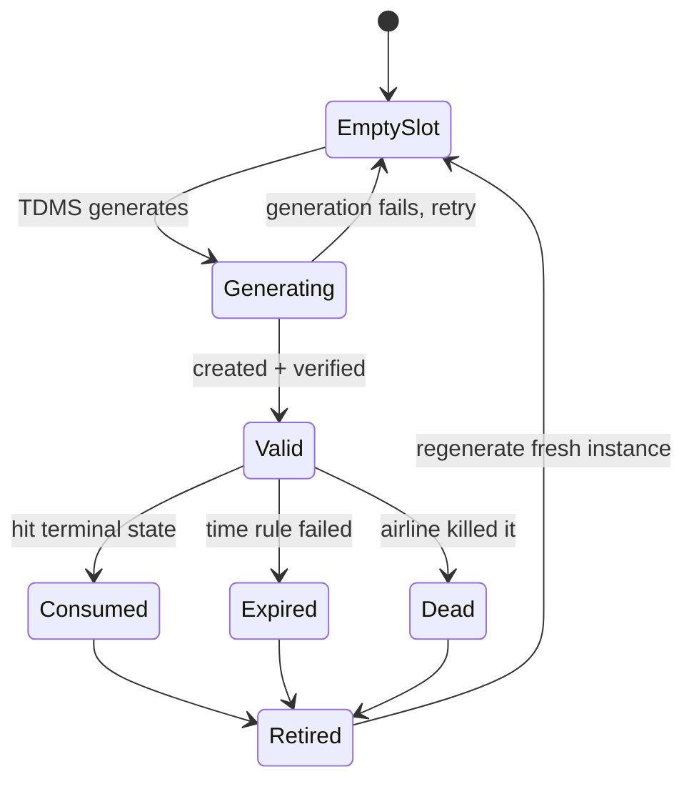

# Test Data Management System (TDMS) — Requirements & Design

Sep 26, 2026 · @Sree

## Purpose

TDMS removes the manual work of creating and maintaining test data for airline booking tests, for both manual and automation testing. Today QA hand-builds a PNR for each test case and keeps it valid by hand; TDMS takes that job over end to end.

The reason this needs a dedicated system is that airline test data is not a static row in a table. A PNR is live state inside the airline's own system, and it can expire, get cancelled, or be purged overnight, often with nobody touching it. So the data cannot be created once and trusted forever; it has to be checked and repaired continuously.

## Core concept: a self-healing loop

TDMS keeps declared intent and live reality in sync automatically. It knows what data should exist (from the test cases), continuously checks what data actually exists and is still valid, and fills any gap it finds.

Declare the goal once, and the system keeps reality matching it. Every mechanism in this document serves that loop: read the requirement, generate the data, verify it against the live PNR, and regenerate whatever has gone bad.

## Two classes of test data

Every test case is one of exactly two classes, and QA declares which; the system never guesses it.

| Class | What the test does | Data handling |
| --- | --- | --- |
| OWNED (mutating) | Changes the booking: cancel, refund, reissue, check-in, add seat/bag/meal | Gets its own dedicated PNR that no other test uses |
| SHARED (read-only) | Only reads the booking: display fare, retrieve PNR, verify price | Many tests share one PNR, because reading changes nothing |

Owned data is never shared, for two reasons. Traceability: if two tests could touch the same PNR, a failure cannot be told apart from one test corrupting another test's data. Parallel safety: because each mutating test owns its PNR, two different mutating tests never collide, so parallel runs need no locking between them.

## Slots and instances

A slot is permanent; an instance is disposable. This distinction is what lets "each test owns its data" and "data is constantly regenerated" both be true at once.

A slot belongs to the test case forever, for example "this cancel test needs one confirmed PNR." The slot never dies. An instance is the actual PNR filling that slot right now; instances get used up or expire and are replaced. A slot always holds one current instance plus a history of retired ones. The slot is owned and stable; instances flow through it.

## Requirement vs rules: Do's and Don'ts

The block a test carries has two intents: the requirement is the Do's (the shape the PNR must have) and the rules are the Don'ts (conditions that must not become true). Data is usable only when all the Do's still hold and no Don't has tripped.

|  | Requirement (Do's) | Rules (Don'ts) |
| --- | --- | --- |
| Answers | Is this the right PNR? | Has this PNR gone bad? |
| Nature | The shape the booking must have | Disqualifying conditions |
| Over time | Fixed at creation, mostly stable | Erode through time, use, or the airline |
| Catches | Wrong shape, requirement drift | Expiry, consumption, death |
| Example | route: AUH-LHR, ticketed: true | check-in window closed, status = CANCELLED |

The split is role and timing, not grammar. The same field can sit on both sides: ticketed: true is a Do (asked for), while "became CANCELLED" is a Don't (used up since). There is also a cost difference. Do's are cheap and mostly static, while Don'ts can only be answered by looking at the live PNR, so the Don'ts are what drive the live health check.

## The authoring block

Each test case carries one YAML block holding both the requirement and the validity rules, filled in by QA. YAML is chosen for readability: it reads almost like plain English, allows comments, and extends easily by adding a line, which is far friendlier than JSON and far more reliable than free text.

```yaml
# What PNR this test needs (the Do's)
requirement:
  airline: EK
  trip_type: round_trip
  passengers:
    ADT: 1
  route: AUH-LHR
  depart: T+90d          # 90 days from the day it is generated
  cabin: economy
  ticketed: true
  ancillaries:
    seat: none
    baggage: none
    lounge: none

# When this data stops being usable (the Don'ts; all must pass)
validity:
  class: OWNED           # OWNED = test changes the booking; SHARED = read-only
  rules:
    - checkin_window: { opens_hrs: 48, closes_hrs: 2 }
    - booking_status: { valid_when: [CONFIRMED, TICKETED], consumed_when: CANCELLED }
```

The most important detail is relative dates (T+90d, T+1w, T+1 for tomorrow). A fixed calendar date would book a trip in the past when the PNR is regenerated months later. Relative dates make the block a template that regenerates correctly forever, which the whole self-heal loop depends on.

## Rule schema and dictionary

A single validity rule (one Don't) has a fixed anatomy: the live PNR field it reads, the operator it applies, and the value or expression it tests against. Every rule fits this one shape, so one generic evaluator can check any rule against a live PNR.

Rules support comparison plus time arithmetic against the current moment (for example, now is before travel\_date minus 48h), which is the level the check-in-window rule needs. Cross-field or aggregate logic (any segment, all passengers) is left out until a real rule requires it.

The shape is the grammar; the dictionary is the vocabulary that says which fields, operators, and values are legal. It lives in version control alongside the schema definitions and is loaded into the runtime, so validation on ingest and evaluation on scan read the same single source. It has three registries:

- Fields: every PNR attribute a rule may reference, each with its canonical path, its data type (enum, datetime, integer, string, boolean), and for enum fields its allowed value set. The type decides which operators are legal on the field.
- Operators: the finite set of tests, each tagged with the data types it works on (equals and in for enums and strings; before, after, and within for datetimes; comparison operators for numbers).
- Enumerated values: the closed sets, such as booking statuses, cabin classes, SSR codes, and airline and airport codes.

Together they enforce one check: a rule is legal only if its field exists, its operator suits that field's type, and its value is valid for that field. The AI tool runs this check before rendering a block, and TDMS runs it again on ingest, so a malformed rule cannot slip through.

Three practical constraints keep the dictionary maintainable:

- Versioned, so the vocabulary can grow without invalidating rules already written against an earlier version.
- Seeded narrow, holding only the fields and values today's rules reference, and grown rule by rule. A PNR has hundreds of attributes, so cataloguing all of them upfront is wasted effort.
- Synonyms and aliasing (mapping CANCELED, CXL, or X to the one canonical CANCELLED) are a later additive layer. The dictionary works fully on canonical values without it, and aliases resolve to those same canonical values when added.

The concrete entry formats (what one field, operator, or enum row literally looks like) are a build-time detail.

## Verifying validity: TDMS owns the truth

Only TDMS writes to its own database, and only after checking the live PNR. The automation system is a pure consumer: it reads data, runs, and never reports back what it used or changed.

The reason is reliability. A test saying "I cancelled it" is a claim about what it tried to do, not what actually happened; the test may have failed or the service may have been down, leaving the PNR alive. Trusting that claim would poison the database. So TDMS looks instead: it reads the PNR's real state and decides. If a cancel test's PNR truly shows CANCELLED, retire it; if not, leave it alone.

This gives a useful property for free: a failed run leaves its data untouched and still valid, ready for the retry. The live check runs in two places, proactively during the scan to fix gaps early, and again at the moment data is handed to a test, so a test never receives a PNR that is secretly dead.

## The instance lifecycle

An owned instance moves from an empty slot to valid, and the only exit from valid is the live health check finding it unusable.



The three failure reasons all lead to Retired: Consumed (the PNR hit its terminal used-up state, such as CANCELLED for a cancel test), Expired (a time rule lapsed, such as the check-in window closing), and Dead (the airline killed it via auto-cancel or purge). A retired instance is kept and linked to the test case and run that used it; that record is the debugging trail, so it is never deleted. Retiring then triggers a fresh instance back into the slot, closing the loop.

Shared read-only data is a lighter version of the same machine: it mostly sits valid and gets read concurrently, and only leaves valid if a health check finds it dead or mis-declared.

## Sync and change detection

TDMS ingests each test's block on a schedule now, with real-time events planned later; both paths use the same ingest routine. The scan runs twice a day, a few hours before the automation pipeline, so anything broken is repaired before the run starts, not during it.

To detect changes cheaply, TDMS normalizes the block (so reformatting is not mistaken for a real change) and hashes it. Any change to the hash flags the PNR onto a needs-updating list. The system then re-evaluates that PNR against the current requirement and rules, and regenerates only if it is now invalid; a still-valid PNR is left in place. An edit that does not actually invalidate the data therefore costs nothing.

The ingest is idempotent: running it twice on the same test does nothing the second time, which is what lets the batch job and the future events share one safe path. A brand-new test case is picked up and given its first instance. A test that disappears from the source is marked orphaned, so generation stops but its history is kept.

## Storage and database

The rule is simple: definitions in version control, authored data in the test case, running data in a database.

- Schema definitions (allowed fields, operators, enums, the contract itself) live in version control. They are code-like, change rarely, and both the AI tool and TDMS depend on them.
- Each test's filled-in block lives in the test case field as the single source of truth, kept next to the test so the two change together and cannot drift apart.
- On each sync, TDMS copies the block into its own database and evaluates against that copy, so it never calls the source system during a scan or a reserve. All live data lives there too: slots, current and retired instances, environment, status, the block's hash, reservations, and traceability links.

Use a relational database (Postgres), not NoSQL. The core is highly relational (test to slot to instances to environment to history) and needs two things relational databases do well: atomic reservation, which locks one available instance so two parallel runs cannot take the same one, and reporting, such as valid counts per environment and replenishment-failing alerts. The flexible block goes in a JSONB column, giving document-style flexibility inside Postgres, so there is no need to run a second database.

## The AI authoring tool

A front-end tool lets QA type plain English and produces the block to place in the test case. The key rule: the AI never free-writes the final text. It fills a structured object locked to the schema, code validates it, and code renders the clean block, so the AI handles intent while formatting and correctness are guaranteed by code, not hoped for.

Three features make it trustworthy:

- A plain-English read-back before anything is saved ("this needs 1 adult round trip AUH-LHR, becomes invalid when the booking is cancelled, correct?"), so the human confirms intent, which is exactly where AI errors hide.
- A canonicalizer, so two people describing the same requirement always produce an identical block. This protects the hash-based change detection and the shared-read dedup.
- A mis-declaration guard at authoring time ("you marked this read-only, but your rule checks status = CANCELLED, which implies a mutation; did you mean OWNED?").

Because a field can always be hand-edited afterwards, TDMS still validates every block when it reads it. Writing the field directly through the test-management tool's API is the better end state; copy-paste is a fine start.

## Open items and next steps

Three pieces are consciously deferred.

1. Rule schema and dictionary: designed at the requirements level (see the section above). What remains is build-time detail, namely the concrete field-path syntax, the operator list, and the dictionary entry format, plus the synonyms and aliasing layer.
2. Immediate vs deferred regeneration: when a block changes, whether to regenerate at ingest, or mark the instance stale and let demand-aware regeneration handle it before the next run.
3. The AI tool's rule-authoring details, now unblocked by the rule schema and dictionary above.
